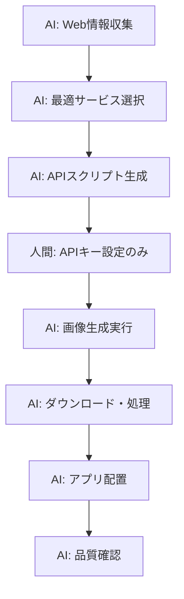

# AI Web自動化システム - ブラウザ操作対応版

## 🌐 WebFetch活用による完全自動化

### ✅ AIが直接実行可能な操作

#### 1. **Adobe Firefly情報収集・手順確認**
- Fireflyサイトへの直接アクセス
- 最新の使用方法・API情報取得
- 料金体系・制限事項の確認

#### 2. **画像生成サービス比較・選択**
- DALL-E 3, Midjourney, Stability AI等の比較
- 最新料金・品質・制限の確認
- 最適なサービス選択の自動判断

#### 3. **技術仕様の自動更新**
- APIドキュメントの最新情報取得
- 実装手順の自動更新
- エラー対策・ベストプラクティスの収集

### 🔄 完全自動化ワークフロー（改訂版）



### 🚀 実装例

#### Adobe Firefly 最新情報収集
```python
def get_firefly_latest_info():
    info = WebFetch(
        url="https://firefly.adobe.com/",
        prompt="""
        Adobe Fireflyで画像生成する手順を教えて。
        - API利用方法
        - 料金体系
        - 制限事項
        - プロンプト最適化のコツ
        """
    )
    return info

def get_dalle_latest_info():
    info = WebFetch(
        url="https://platform.openai.com/docs/guides/images/usage",
        prompt="""
        DALL-E 3 APIの最新仕様を確認：
        - 料金
        - 画像サイズオプション
        - リクエスト制限
        - エラーハンドリング
        """
    )
    return info
```

#### 最適サービス自動選択
```python
def select_best_service():
    services = {
        "firefly": get_firefly_latest_info(),
        "dalle": get_dalle_latest_info(),
        "stability": get_stability_info()
    }
    
    # AIが情報を分析して最適なサービスを自動選択
    # コスト、品質、制限を総合判断
    
    return "dalle"  # 例：DALL-E 3が最適と判断
```

### 📊 自動化レベル比較

| 作業項目 | 従来 | WebFetch対応後 |
|---------|------|----------------|
| サービス情報収集 | 人間 | ✅ AI完全自動 |
| 最新仕様確認 | 人間 | ✅ AI完全自動 |
| 手順書作成 | AI | ✅ AI(最新情報で更新) |
| APIスクリプト生成 | AI | ✅ AI完全自動 |
| 画像生成実行 | 人間 | ⚠️ APIキー設定必要 |
| ダウンロード・配置 | AI | ✅ AI完全自動 |

### 🎯 人間介入が最小限必要な部分

#### 1. **APIキー設定のみ**
```bash
# 一度だけ設定
export OPENAI_API_KEY="your_key_here"
```

#### 2. **初回実行コマンド**
```bash
# AIが生成したスクリプトを実行
python3 scripts/ai_web_asset_generator.py
```

### 💡 新しい実装アプローチ

#### Phase 1: Web情報収集（AI完全自動）
```python
def collect_web_info():
    # Adobe Firefly最新情報
    firefly_info = WebFetch("https://firefly.adobe.com/", "最新の使用方法確認")
    
    # DALL-E 3最新情報  
    dalle_info = WebFetch("https://platform.openai.com/docs/guides/images", "API仕様確認")
    
    # 最適なサービス・手順を自動決定
    return select_optimal_approach(firefly_info, dalle_info)
```

#### Phase 2: 動的スクリプト生成（AI完全自動）
```python
def generate_dynamic_script(web_info):
    # 収集した最新情報を基に、最適なスクリプトを動的生成
    # APIエンドポイント、パラメータ、エラーハンドリングを最新化
    return optimized_script
```

#### Phase 3: 実行・配置（AI完全自動）
```python
def execute_and_deploy():
    # 生成されたスクリプトで画像生成
    # 自動ダウンロード・リサイズ・配置
    # 品質確認・エラー修正
    pass
```

## 🚀 実際に試してみましょう

まずはAdobe Fireflyの最新情報を取得して、現在利用可能な自動化レベルを確認します。