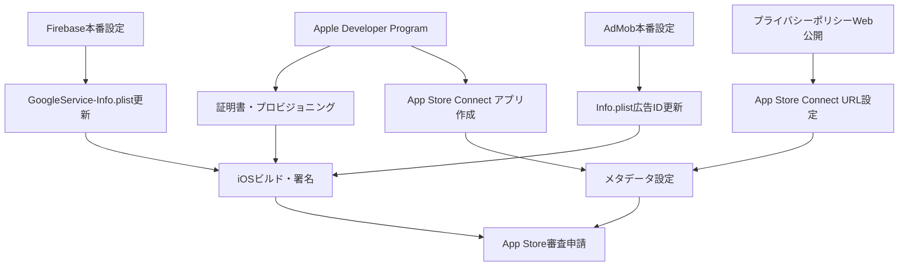

# 人間介入必須作業 - App Store公開準備

## 🎯 概要
AI実行不可能な、アカウント・支払い・認証が必要な作業の詳細ガイド

## 📊 作業優先度・依存関係



## 🚨 Phase 1: Apple Developer Program（最優先）

### 📋 作業内容
**目的**: iOS アプリ開発・配布の基盤アカウント
**費用**: 年額 $99 USD
**所要時間**: 申請24-48時間、承認まで1-7日

### 📝 詳細手順

#### Step 1.1: アカウント準備
```
必要情報:
- Apple ID（個人用）
- 身分証明書（運転免許証・パスポート等）
- 電話番号（SMS認証用）
- クレジットカード または デビットカード
- 住所（英語表記）
```

#### Step 1.2: 申請手順
1. **Apple Developer サイト**: https://developer.apple.com/programs/
2. **「Enroll」クリック**
3. **個人アカウント選択**: "Individual" を選択
4. **Apple ID サインイン**
5. **個人情報入力**: 英語で正確に入力
6. **支払い情報入力**: $99 USD の年額費用
7. **申請完了**: 確認メールを待つ

#### Step 1.3: 承認後の作業
```
承認通知受信後:
1. Apple Developer Portal へログイン
2. Certificates, Identifiers & Profiles 確認
3. App ID 作成: com.casualgames.escapemaster
4. iOS Distribution Certificate 作成
```

### ⚠️ 注意点
- **身分証明**: 入力情報と身分証明書が完全一致必要
- **支払い**: 自動更新、キャンセル可能
- **審査**: 1-7日、稀に追加書類要求

## 💾 Phase 2: Firebase本番プロジェクト設定

### 📋 作業内容
**目的**: テスト用から本番用Analytics設定への切り替え
**費用**: 無料（基本プラン）
**前提**: Googleアカウント

### 📝 詳細手順

#### Step 2.1: Firebase プロジェクト作成
1. **Firebase Console**: https://console.firebase.google.com/
2. **「プロジェクトを追加」クリック**
3. **プロジェクト名**: "escape-master-production"
4. **Analytics 有効化**: ✅ 有効
5. **地域**: 日本

#### Step 2.2: iOS アプリ追加
```
設定情報:
- iOS Bundle ID: com.casualgames.escapemaster
- アプリ名: Escape Master
- App Store ID: （後で設定）
```

#### Step 2.3: 設定ファイル更新
1. **GoogleService-Info.plist ダウンロード**
2. **既存ファイル置き換え**: `ios/Runner/GoogleService-Info.plist`
3. **Xcode プロジェクト更新**: ファイル参照更新

### 🔄 実装タスク（AI実行可能）
```bash
# 新しいGoogleService-Info.plistファイル受領後
cp /path/to/new/GoogleService-Info.plist ios/Runner/
flutter clean
flutter build ios --debug --no-codesign
```

## 💰 Phase 3: Google AdMob本番設定

### 📋 作業内容
**目的**: テスト用広告IDから本番用への切り替え
**費用**: 無料
**前提**: Googleアカウント、税務情報

### 📝 詳細手順

#### Step 3.1: AdMob アカウント作成
1. **AdMob**: https://admob.google.com/
2. **「スタートガイド」クリック**
3. **Googleアカウント連携**
4. **国・地域**: 日本
5. **税務情報入力**: 必須（収益化のため）

#### Step 3.2: アプリ登録
```
アプリ情報:
- プラットフォーム: iOS
- アプリ名: Escape Master
- Bundle ID: com.casualgames.escapemaster
- カテゴリ: ゲーム
```

#### Step 3.3: 広告ユニット作成
```
推奨設定:
- バナー広告: 320x50
- インタースティシャル: フルスクリーン
- リワード動画: オプション
```

#### Step 3.4: アプリID取得
```
取得情報:
- アプリID: ca-app-pub-XXXXXXXXXXXXXXXX~XXXXXXXXXX
- 広告ユニットID: ca-app-pub-XXXXXXXXXXXXXXXX/XXXXXXXXXX
```

### 🔄 実装タスク（AI実行可能）
```xml
<!-- ios/Runner/Info.plist 更新 -->
<key>GADApplicationIdentifier</key>
<string>ca-app-pub-XXXXXXXXXXXXXXXX~XXXXXXXXXX</string>
```

## 🌐 Phase 4: プライバシーポリシーWeb公開

### 📋 作業内容
**目的**: App Store審査必須要件
**方法**: Webサイト・GitHub Pages・無料ホスティング
**費用**: 無料〜数百円/月

### 📝 実装選択肢

#### Option A: GitHub Pages（推奨・無料）
```
手順:
1. GitHub アカウント作成/ログイン
2. 新規リポジトリ作成: "escape-master-privacy"
3. docs/privacy_policy.md を index.md にコピー
4. GitHub Pages 有効化
5. URL取得: https://[username].github.io/escape-master-privacy/
```

#### Option B: 無料ホスティング
```
サービス例:
- Netlify Drop: ファイルドラッグ&ドロップ
- Vercel: Git連携
- Firebase Hosting: 既存プロジェクト活用
```

#### Option C: 独自ドメイン
```
必要な作業:
1. ドメイン取得（.com 年額1,000-2,000円）
2. レンタルサーバー契約
3. HTMLファイルアップロード
4. SSL証明書設定
```

### 🔄 必要なURL
```
プライバシーポリシー: https://[domain]/privacy-policy
利用規約（オプション）: https://[domain]/terms-of-service
```

## 📱 Phase 5: App Store Connect設定

### 📋 作業内容
**目的**: App Store公開申請
**前提**: Apple Developer Program完了
**所要時間**: 初回2-4時間

### 📝 詳細手順

#### Step 5.1: App Store Connect アクセス
1. **URL**: https://appstoreconnect.apple.com/
2. **Apple Developer アカウントでログイン**
3. **「マイ App」選択**

#### Step 5.2: 新規アプリ作成
```
アプリ情報:
- 名前: Escape Master
- プライマリ言語: 日本語
- Bundle ID: com.casualgames.escapemaster
- SKU: escape-master-v1
- ユーザーアクセス: 制限しない
```

#### Step 5.3: メタデータ設定
**準備済みリソース活用**:
```
データソース: docs/app_store_metadata.md
- 説明文（日本語・英語）
- キーワード
- サブタイトル
- プロモーションテキスト
- カテゴリ: ゲーム > パズル
- 年齢制限: 4+
```

#### Step 5.4: プライバシー設定
**準備済みリソース活用**:
```
データソース: docs/app_store_connect_privacy_setup.md
- データ収集設定
- プライバシーラベル
- トラッキング設定
- プライバシーポリシーURL
```

#### Step 5.5: アセット設定
**必要なアセット**:
```
- アプリアイコン: 1024x1024 （準備済み）
- スクリーンショット: iPhone/iPad用（要作成）
```

## 🏗️ Phase 6: iOSビルド・署名・アップロード

### 📋 作業内容
**目的**: App Store審査用ビルド作成・提出
**前提**: 上記Phase 1-5完了
**ツール**: Xcode（macOS必須）

### 📝 詳細手順

#### Step 6.1: 証明書・プロビジョニング設定
```
Xcode設定:
1. プロジェクト選択: Runner
2. Signing & Capabilities タブ
3. Team: Apple Developer アカウント選択
4. Automatically manage signing: ✅ 有効
5. Bundle Identifier: com.casualgames.escapemaster
```

#### Step 6.2: Release ビルド作成
```bash
# 本番設定ファイル更新後
flutter clean
flutter pub get
flutter build ios --release
```

#### Step 6.3: Xcode Archive作成
```
Xcode操作:
1. 「Product」メニュー > 「Archive」
2. Organizer で Archive 確認
3. 「Distribute App」クリック
4. 「App Store Connect」選択
5. アップロード実行
```

#### Step 6.4: App Store Connect で審査申請
```
最終チェック:
1. ビルドが App Store Connect に表示確認
2. メタデータ最終確認
3. プライバシー設定確認
4. 「審査に提出」クリック
```

## ⏰ スケジュール・工数見積もり

### 📅 推奨実行順序（個人作業）

#### 週1: アカウント準備週
```
月曜日: Apple Developer Program 申請
火曜日: Firebase・AdMob アカウント作成
水曜日: プライバシーポリシー Web公開
木-金曜日: 承認待ち・設定準備
土日: 休憩・他作業
```

#### 週2: 設定・統合週
```
月曜日: Apple Developer 承認確認・証明書作成
火曜日: Firebase本番設定・ファイル更新
水曜日: AdMob設定・広告ID更新
木曜日: App Store Connect アプリ作成
金曜日: メタデータ・プライバシー設定
土日: 最終確認・調整
```

#### 週3: ビルド・提出週
```
月曜日: iOSビルド・署名設定
火曜日: Archive作成・アップロード
水曜日: App Store Connect 最終設定
木曜日: 審査申請
金曜日: 審査結果待ち
土日: 次回リリース準備
```

### ⏱️ 各作業の所要時間
```
Apple Developer Program: 30分申請 + 1-7日承認待ち
Firebase設定: 30分
AdMob設定: 45分（税務情報含む）
プライバシーポリシー公開: 15分（GitHub Pages）
App Store Connect設定: 2-3時間（初回）
iOSビルド・提出: 1-2時間
```

### 💰 必要費用
```
Apple Developer Program: $99/年（必須）
ドメイン: $10-20/年（オプション）
ホスティング: 無料-$5/月（オプション）

総計: $99/年 が基本、追加費用は任意
```

## 🆘 トラブルシューティング

### よくある問題と対策

#### Apple Developer Program審査遅延
```
原因: 申請内容不備・身分証明書問題
対策: 正確な情報入力、英語表記統一
```

#### Firebase設定エラー
```
原因: Bundle ID不一致・ファイル配置ミス
対策: Bundle ID 再確認、ファイルパス確認
```

#### AdMob税務情報エラー
```
原因: 住所・個人情報の不整合
対策: 正確な情報入力、サポート問い合わせ
```

#### App Store Connect アップロードエラー
```
原因: 証明書設定・Bundle ID問題
対策: Xcode署名設定確認、Clean Build
```

### 🆘 サポート連絡先
```
Apple Developer Support: https://developer.apple.com/support/
Firebase Support: https://firebase.google.com/support/
AdMob Support: https://support.google.com/admob/
```

## ✅ 完了チェックリスト

### Phase別チェック
```
□ Apple Developer Program 承認完了
□ iOS Distribution Certificate 作成完了
□ Firebase本番プロジェクト設定完了
□ AdMob アカウント・税務情報設定完了
□ プライバシーポリシー Web公開完了
□ App Store Connect アプリ作成完了
□ メタデータ設定完了（日本語・英語）
□ プライバシーラベル設定完了
□ iOSビルド・Archive作成完了
□ App Store Connect アップロード完了
□ 審査申請完了
```

### 最終確認項目
```
□ 全設定ファイル本番用に更新済み
□ テスト動作確認完了
□ スクリーンショット準備完了
□ 審査申請時の注意事項確認済み
□ リリース後の運用計画確認済み
```

## 🎯 成功の鍵

### 重要なポイント
1. **正確性**: 全情報の完全一致（Apple審査厳格）
2. **準備**: 事前の入念な準備とリソース整備
3. **忍耐**: 承認・審査の待ち時間を見込む
4. **継続性**: リリース後の定期的な更新・維持

### 推奨マインドセット
- **慎重に進める**: 急がば回れ
- **準備を重視**: 事前準備が成功の9割
- **学習機会**: 初回は学習投資と考える
- **長期視点**: 継続的なアプリ運営を見据える