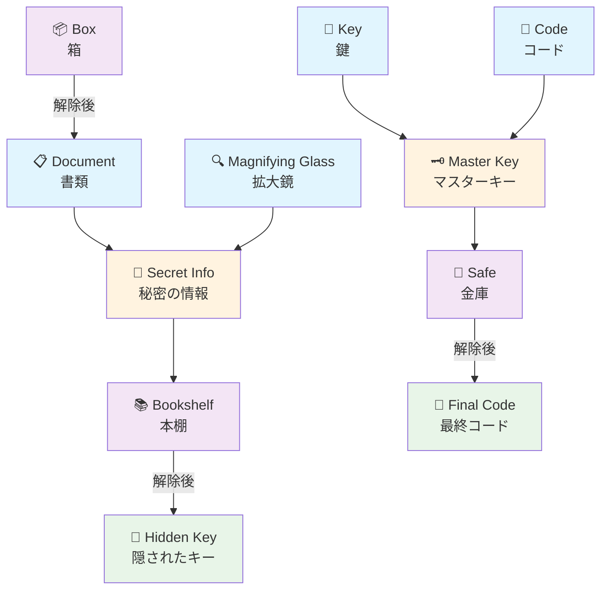
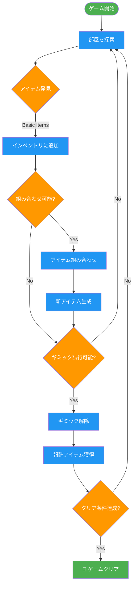
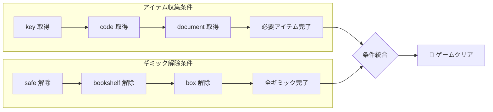

# エスケープルーム ギミック・アイテム管理ドキュメント

## 概要

このドキュメントは、エスケープルームゲームのギミック（仕掛け）とアイテムの組み合わせシステムを視覚的に管理するためのドキュメントです。

## アイテム依存関係図



## ゲーム進行フロー



## アイテム管理テーブル

### 基本アイテム

| アイテムID | 名前 | 説明 | 取得場所 | 消費型 |
|------------|------|------|----------|--------|
| `key` | 鍵 | 古い鍵 | Box | ❌ |
| `code` | コード | 数字の書かれた紙 | Safe | ✅ |
| `document` | 書類 | 重要な書類 | Bookshelf | ❌ |
| `magnifying_glass` | 拡大鏡 | 詳細確認用 | 初期アイテム | ❌ |

### 組み合わせアイテム

| アイテムID | 名前 | 説明 | 必要アイテム | 消費アイテム |
|------------|------|------|-------------|-------------|
| `master_key` | マスターキー | すべての鍵を開く | `key` + `code` | 両方 |
| `secret_info` | 秘密の情報 | 隠された情報 | `document` + `magnifying_glass` | `document` のみ |

## ギミック管理テーブル

### ギミック仕様

| ギミックID | 名前 | 説明 | 必要アイテム | 報酬アイテム | 解除後状態 |
|------------|------|------|-------------|-------------|-----------|
| `safe` | 金庫 | 鍵のかかった金庫 | `key` (基本) または `master_key` (上級) | `code` | 開いた状態 |
| `bookshelf` | 本棚 | 隠し扉付きの本棚 | `secret_info` | `final_code` | 扉開放 |
| `box` | 箱 | シンプルな箱 | なし | `document` | 開いた状態 |

## 組み合わせルール管理

### アイテム組み合わせルール

```yaml
combination_rules:
  key_code_combination:
    id: "key_code_combination"
    required_items: ["key", "code"]
    result_item: "master_key"
    description: "鍵とコードを組み合わせてマスターキーを作成"
    consume_items: true
    
  document_analysis:
    id: "document_analysis"
    required_items: ["document", "magnifying_glass"]
    result_item: "secret_info"
    description: "書類を拡大鏡で詳しく調べる"
    consume_items: false  # 拡大鏡は再利用可能
```

### ギミック解除ルール

```yaml
gimmick_rules:
  safe_master_unlock:
    id: "safe_master_unlock"
    target_object: "safe"
    required_items: ["master_key"]
    success_message: "金庫がマスターキーで開いた！隠されたアイテムを発見！"
    failure_message: "この金庫にはマスターキーが必要だ"
    consume_items: false  # マスターキーは再利用可能
    
  bookshelf_secret_reveal:
    id: "bookshelf_secret_reveal"
    target_object: "bookshelf"
    required_items: ["secret_info"]
    success_message: "本棚の隠し扉が開いた！"
    failure_message: "本棚に何か秘密がありそうだが、手がかりが必要だ"
    consume_items: true
```

## クリア条件

### 必要条件



### 条件詳細

1. **アイテム収集**: `key`, `code`, `document` をすべて収集
2. **ギミック解除**: `safe`, `bookshelf`, `box` をすべて解除
3. **追加条件**: 特定の組み合わせアイテム生成（オプション）

## セーブデータ構造

### ゲーム状態

```json
{
  "game_state": {
    "current_state": "exploring",
    "session_start_time": "2024-01-01T00:00:00Z",
    "elapsed_time_seconds": 300
  },
  "inventory": {
    "items": ["key", "magnifying_glass"],
    "max_capacity": 5
  },
  "clear_conditions": {
    "collect_all_items": {
      "completed": false,
      "progress": ["key"],
      "required": ["key", "code", "document"]
    },
    "interact_all_objects": {
      "completed": false,
      "progress": ["box"],
      "required": ["safe", "bookshelf", "box"]
    }
  },
  "combination_system": {
    "used_combinations": [],
    "activated_gimmicks": ["box"]
  },
  "object_states": {
    "safe": "locked",
    "bookshelf": "closed",
    "box": "opened"
  }
}
```

## 開発者向け情報

### システム実装

- **ClearConditionManager**: クリア条件の管理・追跡
- **ItemCombinationManager**: アイテム組み合わせ・ギミック解除ルールの管理
- **EscapeRoomGameController**: オブジェクト操作履歴の追跡
- **InventoryManager**: アイテム所持・選択の管理

### 追加・変更手順

1. **新アイテム追加**:
   ```dart
   // GameItem として定義
   final newItem = GameItem(
     id: 'new_item',
     name: '新アイテム',
     description: '説明',
     imagePath: 'assets/items/new_item.png',
   );
   ```

2. **新組み合わせルール追加**:
   ```dart
   _itemCombinationManager.addCombinationRule(CombinationRule(
     id: 'new_combination',
     requiredItems: ['item1', 'item2'],
     resultItem: 'result_item',
     description: '新しい組み合わせ',
   ));
   ```

3. **新ギミック追加**:
   ```dart
   _itemCombinationManager.addGimmickRule(GimmickRule(
     id: 'new_gimmick',
     targetObjectId: 'new_object',
     requiredItems: ['required_item'],
     successMessage: '解除成功！',
     failureMessage: '解除失敗...',
   ));
   ```

---

**更新日**: 2024年1月1日  
**バージョン**: 1.0.0  
**担当**: AI Assistant